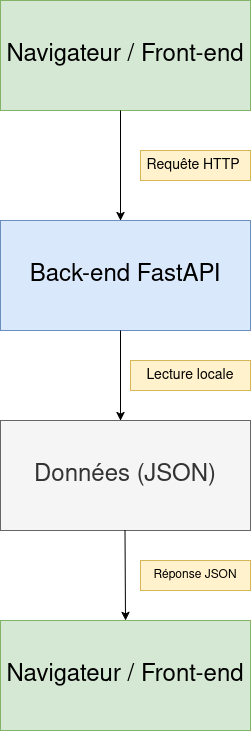

# TME 2 – Conception et mise en place d'une application Web

## 1. Architecture et conception

### 1.1 Étude des architectures logicielles existantes

Avant de concevoir l’architecture de notre application, plusieurs architectures couramment utilisées
en développement logiciel ont été étudiées.

#### 1.1.1 Architecture monolithique

L’architecture monolithique consiste à regrouper l’ensemble de l’application (interface, logique métier
et accès aux données) au sein d’un seul bloc logiciel.

**Avantages :**
- simplicité de mise en place ;
- facilité de déploiement ;
- adaptée aux projets de petite taille.

**Limites :**
- difficile à faire évoluer lorsque l’application grandit ;
- forte dépendance entre les différentes parties du code ;
- maintenance plus complexe à long terme.

**Cas d’usage :**
- prototypes ;
- petites applications ;
- projets avec peu de fonctionnalités.

---

#### 1.1.2 Architecture client–serveur

L’architecture client–serveur repose sur une séparation claire entre le client (front-end) et le serveur
(back-end). Le client envoie des requêtes au serveur, généralement via HTTP, et reçoit des réponses
contenant des données ou des résultats de traitement.

**Avantages :**
- séparation des responsabilités entre interface et logique métier ;
- possibilité d’avoir plusieurs clients pour un même serveur ;
- architecture très répandue pour les applications web.

**Limites :**
- dépendance au réseau ;
- complexité légèrement supérieure à une application monolithique locale.

**Cas d’usage :**
- applications web ;
- applications mobiles ;
- APIs REST.

---

#### 1.1.3 Architecture en couches (Layered Architecture)

L’architecture en couches organise l’application en différentes couches ayant chacune une responsabilité
précise (présentation, logique métier, accès aux données, etc.).

**Avantages :**
- meilleure lisibilité du code ;
- facilité de maintenance ;
- séparation claire des responsabilités.

**Limites :**
- peut introduire une certaine lourdeur pour des projets très simples ;
- surcoût en termes d’organisation du code.

**Cas d’usage :**
- applications d’entreprise ;
- APIs structurées ;
- projets nécessitant une bonne maintenabilité.

---

#### 1.1.4 Architecture microservices

L’architecture microservices consiste à découper l’application en plusieurs services indépendants,
communiquant entre eux via des APIs.

**Avantages :**
- forte scalabilité ;
- indépendance des services ;
- facilité de déploiement indépendant.

**Limites :**
- complexité importante ;
- surdimensionnée pour de petits projets ;
- gestion complexe des communications.

**Cas d’usage :**
- grandes applications ;
- systèmes distribués ;
- plateformes à fort trafic.

---

### 1.2 Étude de design patterns

Les design patterns sont des solutions génériques à des problèmes récurrents de conception logicielle.
Plusieurs patterns ont été étudiés afin d’identifier ceux adaptés à notre projet.

#### 1.2.1 MVC (Model – View – Controller)

Le pattern MVC vise à séparer l’application en trois composants :
- le **Model**, qui représente les données ;
- la **View**, qui correspond à l’interface utilisateur ;
- le **Controller**, qui gère la logique et les interactions.

**Avantages :**
- séparation claire des responsabilités ;
- amélioration de la maintenabilité ;
- facilité de compréhension du code.

**Limites :**
- peut être excessif pour des applications très simples ;
- nécessite une bonne organisation du projet.

---

#### 1.2.2 Repository Pattern

Le pattern Repository permet d’isoler l’accès aux données dans une couche dédiée,
indépendante de la logique métier.

**Avantages :**
- abstraction de la source de données ;
- facilité de modification du stockage des données ;
- code plus testable.

**Limites :**
- ajout d’une couche supplémentaire ;
- peut être inutile pour des projets très simples.

---

### 1.3 Choix de l’architecture et des design patterns

Pour ce projet, une **architecture client–serveur** a été retenue, combinée à une
**architecture en couches** côté back-end.

Ce choix s’explique par le fait que l’application est une application web classique,
avec un front-end chargé de l’affichage et un back-end chargé de fournir des données via une API HTTP.

Concernant les design patterns, le pattern **MVC** a été retenu car il permet une séparation claire
entre les données, la logique et l’interface, ce qui facilite la compréhension et la maintenance du projet.
Le pattern Repository pourra être utilisé pour structurer l’accès aux données (fichier JSON jouant
le rôle de base de données simplifiée).

Les architectures plus complexes, comme les microservices, n’ont pas été retenues car elles sont
surdimensionnées pour un projet de cette taille et augmenteraient inutilement la complexité.

---

### 1.4 Conception finale de l’application

La conception finale de l’application repose sur une architecture **client–serveur**,
avec une séparation claire entre le front-end, le back-end et la couche de données.
Cette organisation permet une meilleure lisibilité du projet, facilite la maintenance
et correspond aux pratiques courantes en développement web.

#### Schéma d’architecture

Un schéma d’architecture a été réalisé afin d’illustrer les différents composants
de l’application ainsi que leurs interactions. Il met en évidence la communication
entre le front-end et le back-end via des requêtes HTTP, ainsi que l’accès aux données
côté serveur.

 

{ width=80% placement=H }

 

#### Organisation globale de l’application

L’application est organisée en trois parties principales :

- un **front-end**, responsable de l’affichage et de l’interaction avec l’utilisateur ;
- un **back-end**, chargé de la logique applicative et de l’exposition d’une API HTTP ;
- une **couche de données**, utilisée pour stocker et fournir les informations.

Cette organisation respecte le principe de séparation des responsabilités, ce qui
permet de faire évoluer chaque partie indépendamment des autres.

#### Rôle des composants

- **Front-end** :  
  Le front-end correspond à l’interface utilisateur de l’application.
  Il est développé à l’aide de technologies web (HTML, CSS et JavaScript).
  Son rôle est d’afficher la liste des films, de déclencher des requêtes HTTP vers
  le back-end et de construire dynamiquement l’interface à partir des données reçues.

- **Back-end** :  
  Le back-end est une API HTTP développée avec FastAPI.
  Il reçoit les requêtes du front-end, traite la logique applicative et renvoie
  les données au format JSON.
  Il assure également l’accès aux données stockées et la gestion des ressources
  statiques telles que les images.

- **Données** :  
  Les données sont stockées dans un fichier JSON, qui joue le rôle d’une base de
  données simplifiée.
  Ce choix permet de se concentrer sur la logique de l’application sans introduire
  la complexité d’un système de gestion de base de données.

## 2.2.1 Étape 0 – Choix de la stack back-end (recherche)

Pour ce projet, nous avons étudié **trois langages back-end populaires** : Python, JavaScript (Node.js) et Java.

### Python
- **Contextes d’utilisation :** développement web, APIs REST, data science, microservices, scripts.
- **Types d’applications adaptés :** web, API, data, microservices.
- **Points forts :** syntaxe simple, développement rapide, riche écosystème (FastAPI, Flask, Django), documentation et communauté très actives.
- **Points faibles :** performances légèrement inférieures pour des applications très haute charge ou temps réel.

### JavaScript / Node.js
- **Contextes d’utilisation :** back-end web, applications temps réel (chat, jeux), APIs REST, microservices.
- **Types d’applications adaptés :** web, API, temps réel.
- **Points forts :** même langage côté front-end et back-end, asynchrone par défaut, large écosystème.
- **Points faibles :** syntaxe asynchrone parfois complexe pour les débutants, certaines bibliothèques moins matures.

### Java
- **Contextes d’utilisation :** applications d’entreprise, systèmes critiques, APIs robustes.
- **Types d’applications adaptés :** web, API, microservices, systèmes critiques.
- **Points forts :** très performant, stable, riche écosystème (Spring, Hibernate).
- **Points faibles :** syntaxe plus verbeuse, développement plus long, configuration parfois complexe.

## 2.2.2 KPI : notion “entreprise”

Pour comparer les langages back-end et prendre une décision adaptée au projet, nous avons défini les **KPI (Key Performance Indicators)** suivants :  

+-----------------------------+----------------------+------------------------+---------------------------+
| KPI                         | Python               | Node.js                | Java                      |
+-----------------------------+----------------------+------------------------+---------------------------+
| Courbe d’apprentissage      | Facile               | Moyenne                | Moyenne/Difficile         |
+-----------------------------+----------------------+------------------------+---------------------------+
| Écosystème (libs, frameworks, outils) | Très riche       | Riche                  | Très riche                |
+-----------------------------+----------------------+------------------------+---------------------------+
| Performance                 | Moyenne              | Bonne (asynchrone)    | Très bonne                |
+-----------------------------+----------------------+------------------------+---------------------------+
| Productivité (temps de développement) | Très rapide     | Rapide                 | Moyenne                   |
+-----------------------------+----------------------+------------------------+---------------------------+
| Marché de l’emploi           | Élevé               | Élevé                  | Élevé                     |
+-----------------------------+----------------------+------------------------+---------------------------+
| Communauté (docs, forums, support) | Large et active | Large                 | Large                     |
+-----------------------------+----------------------+------------------------+---------------------------+
| Cas d’usage typiques        | API, web, microservices | API, web, temps réel | API d’entreprise, web    |
+-----------------------------+----------------------+------------------------+---------------------------+

**Choix retenu : Python + FastAPI**  

**Justification :**  
- Syntaxe simple et lisible → développement rapide pour un projet pédagogique.  
- FastAPI permet de créer facilement des APIs REST avec documentation automatique (Swagger).  
- Compatible avec le front-end prévu (JSON).  
- Adapté à une petite application web, évolutif si besoin.

## 2.3.1 Environnement virtuel Python

Avant d’installer des librairies et de coder le back-end, il est essentiel d’utiliser un **environnement virtuel** Python (`venv`).  

### Qu’est-ce qu’un environnement virtuel ?

Un environnement virtuel est un espace isolé où Python et ses librairies peuvent être installés **sans interférer avec les autres projets ou la version système de Python**.  

### Pourquoi utiliser un environnement virtuel ?

- Permet de gérer **différentes versions de librairies** pour différents projets.  
- Évite les conflits entre projets.  
- Pratique en entreprise pour garantir la reproductibilité des installations et des déploiements.

## 2.4.2

JSON (JavaScript Object Notation) est un format de données léger et lisible par l’humain, utilisé pour représenter des objets et des structures de données sous forme de paires clé/valeur.

Les clés sont des chaînes de caractères.

Les valeurs peuvent être : chaînes, nombres, booléens, tableaux...

Pourquoi JSON est largement utilisé dans les API web :

Facile à lire pour les développeurs et machines.

Moins verbeux que XML, donc transfert plus rapide sur le web.

Compatibilité : supporté nativement par presque tous les langages modernes (Python, Java, JavaScript…).

Interopérable : permet de transmettre facilement des objets complexes entre serveur et client.

Exemple : une API web qui renvoie des informations sur un film peut retourner :

{
  "titre": "Inception",
  "année": 2010,
  "réalisateur": "Christopher Nolan"
}

Le client (application web ou mobile) peut directement lire ces données et les afficher.

Autres formats de données et cas d’usage: 

Format	
CSV (Comma-Separated Values)	Fichier texte où les données sont séparées par des virgules.	Import/export de tableaux de données, par exemple pour Excel ou un logiciel de statistiques.

XML (eXtensible Markup Language)	Format structuré avec des balises similaires au HTML.	Communication entre systèmes anciens ou industries où XML est standard (ex : services web SOAP).

YAML (YAML Ain’t Markup Language)	Format lisible par l’humain, souvent utilisé pour configurer des applications.	Fichiers de configuration pour Docker, Kubernetes, ou projets Python.

